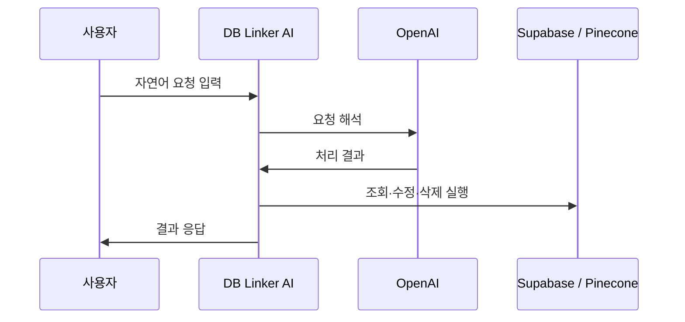

# DB Linker — AI로 다루는 데이터베이스

- App Store: [apps.apple.com](https://apps.apple.com/kr/app/db-linker/id6762522023)
- 개인정보처리방침: [sanglimsoft.com/privacy/db-linker](https://sanglimsoft.com/privacy/db-linker/)
- 고객지원: [sanglimsoft.com/support](https://sanglimsoft.com/support/)

**DB Linker**는 데이터베이스를 조회·수정·삭제하는 작업을 AI 채팅으로 처리할 수 있게 해주는 도구입니다. OpenAI, Supabase, Pinecone 같은 외부 서비스와 연동됩니다.

## 어떻게 동작하나요

### 이용 흐름

## 이런 분께 추천합니다

- SQL을 매번 직접 쓰지 않고 자연어로 DB 작업을 하고 싶은 개발자
- Supabase/Pinecone 기반 프로젝트를 다루는 분

## 주요 기능

- AI 채팅 기반 DB 조회·수정·삭제
- OpenAI / Supabase / Pinecone 연동
